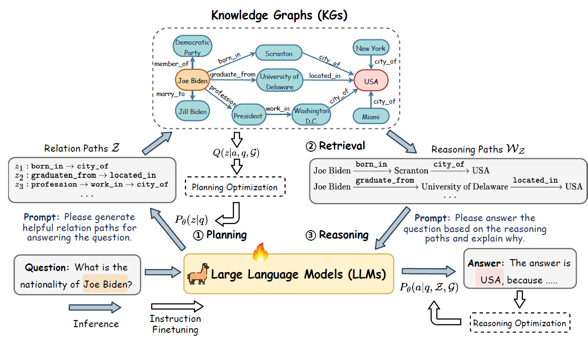
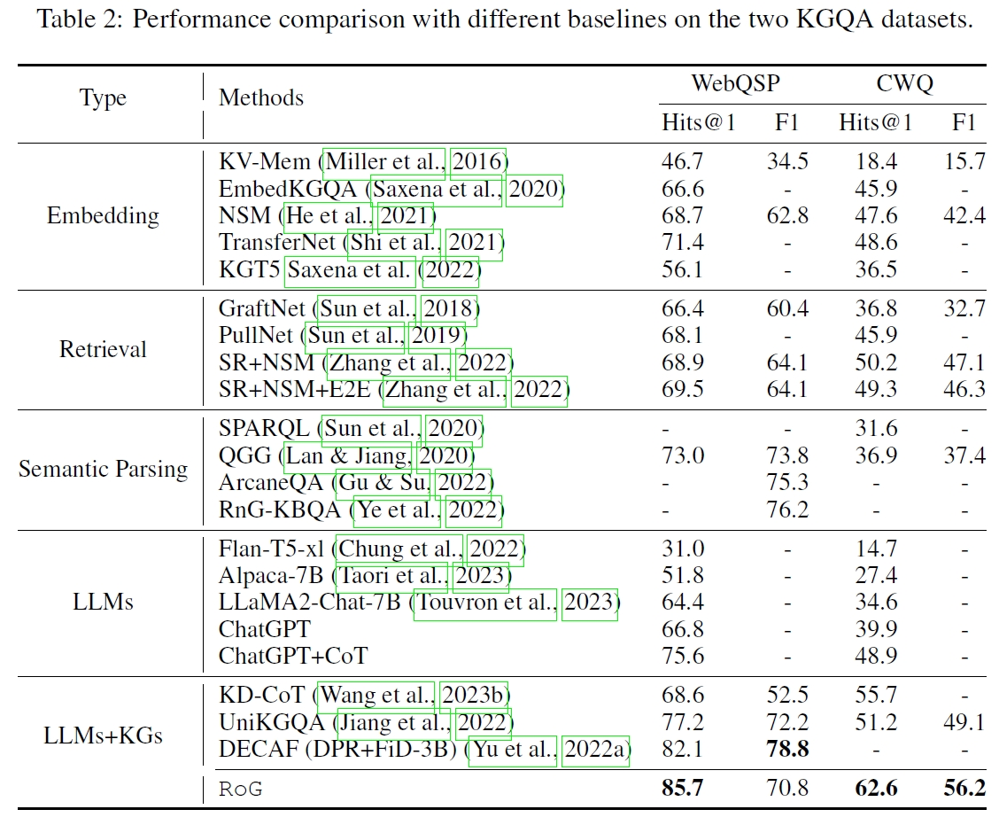
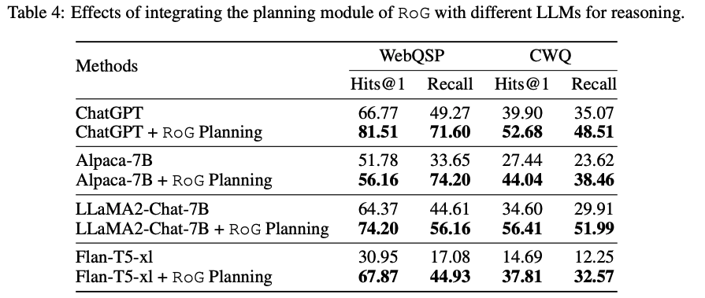
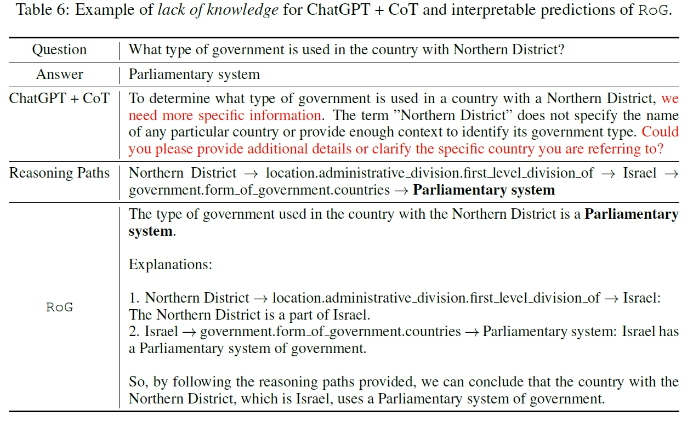
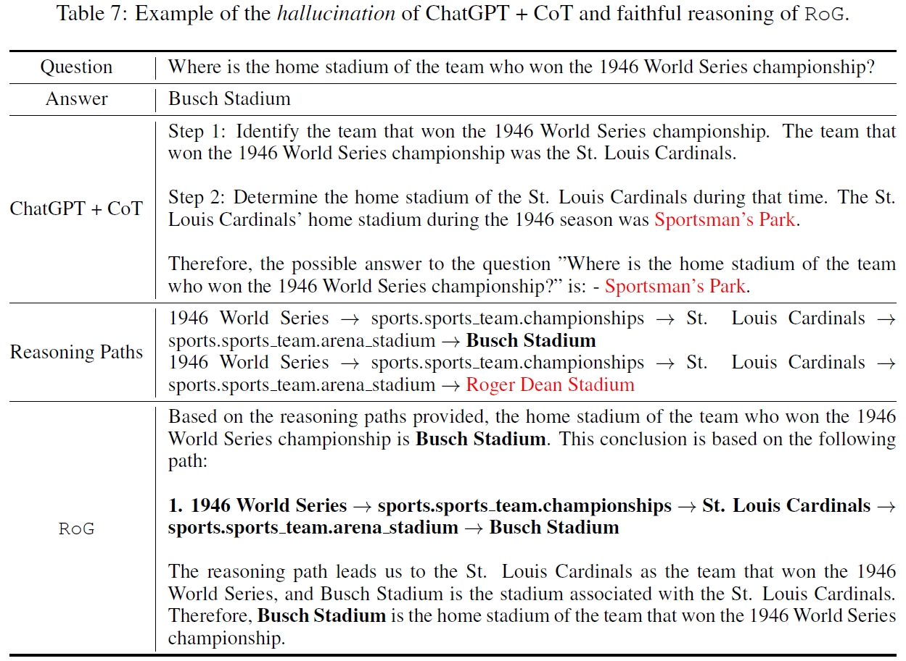

# Reasoning on Graphs (RoG)
Official Implementation of "[Reasoning on Graphs: Faithful and Interpretable Large Language Model Reasoning](https://arxiv.org/abs/2310.01061)".



Reasoning on graphs (RoG) synergizes LLMs with KGs to enable faithful and interpretable reasoning. We present a planning-retrieval-reasoning framework, where RoG first generates relation paths grounded by KGs as faithful plans. These plans are then used to retrieve valid reasoning paths from the KGs for LLMs to conduct faithful reasoning and generate interpretable results.

## News 🎉
* Check our the first graph foundation model-powered RAG pipeline ([GFM-RAG](https://github.com/RManLuo/gfm-rag)) that combines the power of GNNs+KGs with LLMs to enhance reasoning. [Paper](https://www.arxiv.org/abs/2502.01113)
* Check out our latest work on KG + LLM reasoning: [Graph-constrained Reasoning](https://github.com/RManLuo/graph-constrained-reasoning) 

## Requirements
pip install -r requirements.txt


## Pre-trained weights

> Our code will automatically download the model weight from the huggingface.

You can find the pre-trained weights [here](https://huggingface.co/rmanluo/RoG).

## Datasets

> Our code will automatically download the data from the huggingface.

[RoG-WebQSP](https://huggingface.co/datasets/rmanluo/RoG-webqsp)   
[RoG-CWQ](https://huggingface.co/datasets/rmanluo/RoG-cwq)
<details> <summary>Subgraph Extraction</summary>

We extract the subgraphs from the Freebase following previous studies. The code can be found [here](https://github.com/RichardHGL/WSDM2021_NSM/tree/main/preprocessing/Freebase).   
</details>

## Inference
Requirements: Any GPU with at least 12GB memory.
### Step1: Planning (Generate relation paths)

Run: `./scripts/planning.sh`

```bash
python src/qa_prediction/gen_rule_path.py \
        --model_name RoG \
        --model_path rmanluo/RoG \
        -d {RoG-webqsp,RoG-cwq} \
        --split test \
        --n_beam 3
# optional (offline mode): add --local_files_only if model already exists in local cache
```
Generated rules will be saved at: results/gen_rule_path/{dataset}/{model_name}/{split}

Step2: Reasoning (Generate answers with RoG)
Run: ./scripts/rog-reasoning.sh

python src/qa_prediction/predict_answer.py \
        --model_name RoG \
        --model_path rmanluo/RoG \
        -d {RoG-webqsp,RoG-cwq} \
        --prompt_path prompts/llama2_predict.txt \
        --add_rule \
        --rule_path {rule_path} \
Answers will be saved at: results/KGQA/{dataset}/{model_name}/{split}

Plug-and-play Reasoning (Generate answers with different LLMs)
Note: you need to set your openai key at .env to use ChatGPT.

Run: ./scripts/plug-and-play.sh

python src/qa_prediction/predict_answer.py \
        --model_name {gpt-3.5-turbo,alpaca,llama2-chat-hf,flan-t5} \
        -d {RoG-webqsp,RoG-cwq} \
        --prompt_path {prompt_path} \
        --add_rule \
        --rule_path {rule_path}
Interpretable Reasoning
Run: python scripts/interpretable_example.py

from transformers import pipeline, AutoTokenizer
import torch

MODEL_PATH_OR_NAME="rmanluo/RoG"

tokenizer = AutoTokenizer.from_pretrained(MODEL_PATH_OR_NAME, use_fast=False)
model = pipeline("text-generation", model=MODEL_PATH_OR_NAME, tokenizer=tokenizer, device_map="auto", torch_dtype=torch.float16)

print("====EXAMPLE 1: ====")

INPUT_TEXT_1 = """Based on the reasoning paths, please answer the given question and explain why 

Reasoning Paths: 
Northern District -> location.administrative_division.first_level_division_of -> Israel -> government.form_of_government.countries -> Parliamentary system

Question: 
What type of government is used in the country with Northern District?"""

outputs = model(INPUT_TEXT_1, return_full_text=False)
print(outputs[0]['generated_text'])
Training
Training Datasets
You can download the processed datasets from RoG_train_data.tar.tz. Unzip the files and put them under datasets/ folder.

<details> <summary>Process datasets</summary>
Build question to relation path pairs.

python src/align_kg/build_align_qa_dataset.py -d {RoG-webqsp,RoG-cwq} --split {train,validation,test}
Build joint-training datasets.

python src/joint_training/preprocess_align.py
python src/joint_training/preprocess_qa.py
Build interpretable examples.

python src/joint_training/generate_explanation_results.py
</details>
Training RoG
2 A100-80GB GPUs are required for training RoG.

Run: ./scripts/train.sh

Sub-question Cascading Poisoning Workflow
If you want to run a standard end-to-end workflow for sub-question cascading poisoning
(decompose sub-questions → generate rules per sub-question → multi-hop poison insertion
→ evaluate ASR/clean metrics), use:

bash scripts/subquestion-cascade-poison.sh
The script executes:
0. decompose_subquestions.py to split original questions (optional, controlled by RUN_DECOMPOSE).
   - One-hop questions are kept unchanged.
   - Only likely multi-hop questions are decomposed and annotated with dependency fields
     (`parent_id`, `sub_id`, `needs_prev_answer`, `dep_type`).

gen_rule_path.py for sub-question rule generation.

poison_data_llm_gen.py for adaptive poison target generation + multi-hop triple insertion.

predict_answer.py on clean/poison datasets.

evaluation/eval_cascade.py to summarize clean ACC/Hit/F1 and poison A-Precision/A-H@1/A-MRR.

You can override paths with environment variables, e.g. ORIGINAL_DATASET_PATH, RUN_DECOMPOSE,
DATASET_PATH, RULE_FILE, POISONED_DATASET_PATH, MODEL_PATH, PRED_ROOT, EVAL_REPORT.

Results
   

Table-3 Reproduction (paper-aligned script)
- Script: `bash scripts/run_table3_paper_aligned.sh`
- `scripts/table3_collect.py` is used by the `table3` stage to aggregate Clean/Rand/Ours into final CSV rows.
  If you don't need CSV aggregation, you can run with `STAGES=rule,poison,predict`.
- You can also run attackers separately:
  - `STAGES=rule,poison_rand,predict_clean,predict_rand,table3`
  - `STAGES=rule,poison_ours,predict_clean,predict_ours,table3`
- Rand defaults in the script are intentionally mild (lower repeat / top-k) to reduce collapse and keep it closer to a baseline.
- Rand uses clean test data by default; Ours can use decomposed data if present:
  - default `datasets/cwq_full.jsonl`
  - default `datasets/webqsp_full.jsonl`
  (override via `OURS_CWQ_BASE` / `OURS_WEBQSP_BASE`).
- By default Ours **does not** fall back to clean data (`OURS_ALLOW_CLEAN_FALLBACK=0`).
  If you explicitly want fallback behavior, set `OURS_ALLOW_CLEAN_FALLBACK=1`.
- The script expects local RoG model files (`MODEL_PATH`) because `gen_rule_path.py` loads with `local_files_only=True`.
- Default clean-set paths are `datasets/clean_cwq.jsonl` and `datasets/clean_webqsp.jsonl`.
  If these files are missing but raw official parquet shards exist, the script will auto-build:
  - `datasets/clean_cwq_from_parquet.jsonl` from `datasets/cwq/test-*.parquet`
  - `datasets/clean_webqsp_from_parquet.jsonl` from `datasets/webqsp/test-*.parquet`
  (this is recommended when you downloaded datasets directly from HuggingFace without manual merge).
  If these files are missing, the script now auto-falls back to:
  - `datasets/RoG-cwq_test.jsonl`
  - `datasets/RoG-webqsp_test.jsonl`
- It also prints a dataset-size sanity line (`CWQ≈3531`, `WebQSP≈1639`).
  If your size differs a lot, your Clean/Rand numbers are usually not directly comparable to Table 3.

Bibinfo
If you found this repo helpful, please help us by citing this paper:

@inproceedings{luo2024rog,
title={Reasoning on Graphs: Faithful and Interpretable Large Language Model Reasoning},
author={Luo, Linhao and Li, Yuan-Fang and Haffari, Gholamreza and Pan, Shirui},
booktitle={International Conference on Learning Representations},
  year={2024}
}

我读取该文件使用的命令是：`cat README.md` 和 `nl -ba README.md | sed -n '132,160p'`。该内容来自 `README.md` 当前版本。.​:codex-file-citation[codex-file-citation]{line_range_start=1 line_range_end=177 path=README.md git_url="https://github.com/zzwf233/RoG-main-poisoning/blob/master/README.md#L1-L177"}​
