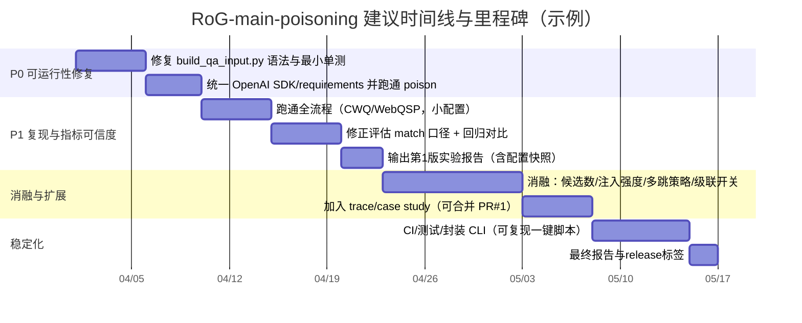

# RoG-main-poisoning 仓库深度评估报告

## 执行摘要

本次评估基于你正在维护的仓库内容（优先：README、脚本、核心代码；并结合少量外部高质量论文/官方页面）完成。fileciteturn61file0L1-L1

已启用并使用的连接器：github（仅此一个）。fileciteturn61file0L1-L1

**项目定位与目标（从仓库内容推断）**：该仓库围绕 RoG（Reasoning on Graphs）的“规划-检索-推理”KG-RAG / KGQA 工作流，增加“主任务投毒（main poisoning）”与“子问题级联投毒（sub-question cascading poisoning）”的生成、推理与评估流水线，目标是复现/扩展论文对 KG-RAG 系统的投毒安全评测与结果对比。fileciteturn61file0L1-L1 citeturn3search5turn3search3

**关键优势（可行性加分项）**  
仓库提供了端到端基准脚本（分解→规则生成→自适应投毒→推理→评估），并在评估侧引入“攻击成功率类指标 + 子问题传播（spread） + 链路指标（chain metrics）”这一更贴近级联场景的指标集合，研究型目标较明确。fileciteturn70file0L1-L1 fileciteturn72file0L1-L1

**阻断级问题（当前版本会直接影响项目可运行性/可复现性）**  
1) **核心 PromptBuilder 文件存在明显缩进错误，按 Python 语法将直接报错**，从而阻断 `predict_answer.py` 的 import 与整套推理链路（属于 P0 级修复）。fileciteturn74file0L1-L1 fileciteturn71file0L1-L1  
2) **OpenAI SDK 版本使用方式在仓库内自相矛盾**：`poison_data_adaptive.py` 采用新 SDK 风格 `from openai import OpenAI`，而 `requirements.txt` 固定为 `openai==0.27.9`（旧接口），同时 `llm_proxy/chatgpt.py` 也更接近旧接口范式。这会导致“投毒阶段”在按 requirements 安装时直接失败（同样是 P0/P1）。fileciteturn69file0L1-L1 fileciteturn12file0L1-L1 fileciteturn35file0L1-L1 fileciteturn37file0L1-L1  
3) 文档与脚本存在漂移：README 仍提到已删除脚本（例如 `scripts/subquestion-cascade-poison.sh`），而提交记录显示其被移除；这会显著降低“外部复现者”成功率（P1）。fileciteturn58file0L1-L1 fileciteturn61file0L1-L1

**可行性结论（简版）**  
- **研究复现/实验型可行性：中等（需先完成 P0 修复）**。修复 PromptBuilder 语法、统一 OpenAI SDK 依赖、补齐运行前置与数据/模型获取说明后，可较稳定地跑通“全链路基准脚本”。fileciteturn70file0L1-L1  
- **工程化/产品化可行性：偏低（当前更像研究代码）**。原因包括：测试与CI缺失、指标定义偏“字符串包含”可能导致偏差、数据/模型体量与API成本较高、以及“攻击代码”缺乏隔离与安全护栏。fileciteturn72file0L1-L1 fileciteturn73file0L1-L1 citeturn4search0

## 未指定假设与边界条件

以下是你未在需求中明确给出的关键假设；报告其余部分如引用这些维度，会统一标注为“未指定”，并给出可选方案以便落地：

- 目标用户：未指定（可能是研究者/复现者/安全评测团队/课程项目）。  
- 目标系统形态：未指定（仅本地离线复现；还是要接入线上RAG/KG-RAG服务做安全评测）。  
- 目标数据范围：未指定（只跑 WebQSP/CWQ 测试集；还是含训练/验证；是否含自建KG）。公开 RoG 数据集页面显示 WebQSP 测试约 1.63k、CWQ 测试约 3.53k。citeturn5view0turn5view1  
- 目标模型：未指定（是否必须使用 rmanluo/RoG；是否可替换为其它 LLM）。rmanluo/RoG 页面显示为 7B 参数、权重约 27GB（F16）。citeturn6view0turn6view1  
- 部署/硬件：未指定（GPU 型号与数量、是否允许外网访问 API、是否有高速存储）。README 提到训练资源门槛较高（示例为 2×A100-80GB），但你本次需求未指定是否要训练还是仅推理评测。fileciteturn61file0L1-L1  
- 预算：未指定（尤其是第三方 LLM API 调用成本、GPU 租赁成本）。  
- 时间线：未指定（是 1 周内跑通、还是 1–2 个月做系统型研究）。  
- 安全/合规边界：未指定（评测对象是否“已授权可测试”、数据是否含敏感信息、结果是否公开）。

## 仓库结构与代码模块详解

### 总体架构理解

仓库实现了一个典型的 RoG 流程：**规划（生成 relation path 规则）→ 检索（在 KG 上按规则 BFS 得到 reasoning paths）→ 推理（LLM 基于 reasoning paths 作答）**，并在此基础上加入“对 KG 图三元组进行插入式污染（poison triples）”与“子问题链路传播”的攻击评估。citeturn3search5turn3search3 fileciteturn68file0L1-L1 fileciteturn72file0L1-L1

image_group{"layout":"carousel","aspect_ratio":"16:9","query":["Reasoning on Graphs RoG planning retrieval reasoning diagram","knowledge graph question answering planning retrieval reasoning framework","KG-RAG poisoning attack diagram triple injection"]}

### 结构与模块表

下表按“能跑通全链路”所需的关键路径组织（并补充训练/对齐相关模块）。表中“依赖”一栏以 `requirements.txt` 与代码 import 为准；如存在依赖冲突会在备注中说明。fileciteturn12file0L1-L1

| 文件/目录 | 功能定位 | 关键函数/类（示例） | 关键依赖/外部资源 |
|---|---|---|---|
| `README.md` | 项目说明、复现指引、攻击流程说明 | — | 依赖脚本与数据文件命名一致性（当前有漂移风险）fileciteturn61file0L1-L1 |
| `LICENSE` | 许可证（MIT） | — | 法务/合规边界：MIT 许可允许再发布与修改fileciteturn81file0L1-L1 |
| `requirements.txt` | Python 依赖锁定 | — | **存在 openai 版本与代码不一致风险**（详见后文）fileciteturn12file0L1-L1 |
| `scripts/run_full_cascade_benchmark.sh` | 一键全流程：copy→分解→规则→投毒→推理（clean/poison）→评估 | `copy_full_inputs`/`decompose_dataset`/`gen_rule_dataset`/`poison_dataset`/`predict_dataset`/`eval_dataset` | 需要本地数据文件（`datasets/clean_*.jsonl` 等），并可选使用 OpenAI-compatible API（示例 base_url 指向 `api.siliconflow.cn`）fileciteturn70file0L1-L1 |
| `src/attack_scripts_adaptive/decompose_subquestions.py` | 将复杂问题拆解为子问题链（为 cascade 评估提供 `parent_id/sub_id/dep_type/needs_prev_answer` 字段） | 主要入口 `main`（生成子问题与依赖标注） | 纯 Python（依赖较少），但其输出 schema 被后续 `predict_answer.py` 与 `eval_cascade.py` 强依赖fileciteturn27file0L1-L1 fileciteturn71file0L1-L1 |
| `src/qa_prediction/gen_rule_path.py` | 规则生成（规划阶段）：对每题生成 relation path（可为 1-hop/2-hop） | `parse_prediction`（regex 抽取 dotted relation）、`main`（beam search 生成） | `transformers`、`peft`、本地模型目录（`local_files_only=True`），以及输出到 `results/gen_rule_path/...`fileciteturn68file0L1-L1 |
| `src/attack_scripts_adaptive/poison_data_adaptive.py` | 自适应投毒：基于规则选择 pivot/target，向图中插入 poison triples；并对 bridge/coref 依赖做“继承式传播” | `load_rog_rules`、`llm_plan_pivot_attack`、`apply_dependency_bridge_targets` | **OpenAI-compatible API**（新 SDK 风格）、`tqdm`；会写出 `datasets/poisoned_*_dynamic_*.jsonl`fileciteturn69file0L1-L1 |
| `src/qa_prediction/build_qa_input.py` | 构建推理 prompt：将 reasoning paths + question 组装成模型输入；包含“投毒样本路径优先”逻辑 | `PromptBuilder.process_input`、`check_prompt_length` | **当前文件存在缩进错误，按 Python 语法会直接失败**；依赖 `utils.bfs_with_rule`、`utils.path_to_string`fileciteturn74file0L1-L1 |
| `src/qa_prediction/predict_answer.py` | 统一推理入口：加载数据→合并规则→构造 prompt→LLM 生成；支持 `--cascade_mode`（链式注入上一子问题答案） | `merge_rule_result`、`inject_prev_answer`、`prediction`、`main` | 依赖 `PromptBuilder`（当前被其语法错误阻断）、依赖 `llms.language_models` 的模型注册机制fileciteturn71file0L1-L1 |
| `src/qa_prediction/evaluate_results.py` | 预测结果评估（通用 KGQA）：acc/hit/F1/precision/recall（基于 normalize+substring match） | `eval_result`、`eval_f1` | `scikit-learn`（但部分导入未使用）；评估方式可能高估（后文详述）fileciteturn73file0L1-L1 |
| `src/evaluation/eval_cascade.py` | 级联/投毒专项评估：clean 指标 + poison 指标（A-precision/A-H@1/A-MRR）+ 子问题传播 + chain metrics | `evaluate_clean`、`evaluate_poison`、`evaluate_subquestion_spread`、`evaluate_chain_metrics` | 依赖 `poison_data_file` 以取得 adversarial answers；同样采用 normalize+substring match，存在偏差风险fileciteturn72file0L1-L1 |
| `src/llms/*` | LLM 统一接口与适配（OpenAI/本地模型/fastchat 等） | `llm_proxy`、`language_models/chatgpt.py`、`language_models/llama.py` | 与 `requirements.txt` 的 openai 版本耦合；建议统一（后文给出方案）fileciteturn35file0L1-L1 fileciteturn37file0L1-L1 |
| `scripts/run_table3_paper_aligned.sh`、`scripts/table3_collect.py` | Table-3 复现实验与结果汇总（clean/rand/ours 对比） | 汇总脚本读取各方法预测输出 | 需要数据、模型、规则输出路径一致；脚本本身还隐含额外依赖（例如 pandas/pyarrow）但 requirements 未显式声明fileciteturn40file0L1-L1 fileciteturn41file0L1-L1 |
| `scripts/plug-and-play.sh` | 试图提供可插拔推理流程（现状更像草稿/中断脚本） | — | 脚本内容存在明显可执行性风险（建议重写/删除或标记 deprecated）fileciteturn44file0L1-L1 |
| `src/joint_training/*`、`src/align_kg/*` | 训练与 KG 对齐相关（更接近原 RoG 训练线） | `joint_finetuning.py`、`data_loader.py` | `trl/peft/transformers/deepspeed` 等；可能需要 HF token（`use_auth_token=True`）fileciteturn63file0L1-L1 fileciteturn67file0L1-L1 |
| PR #1（未合并） | 添加 case study 与 poison path trace 脚本，并修改 eval_cascade | `scripts/build_case_study_table.py`、`scripts/trace_poison_paths.py` | 属于“分析增强”，但当前未进入主分支；建议评估后合并fileciteturn76file0L1-L1 |

**一致性/演进提示**：提交历史显示仓库曾删除 `scripts/subquestion-cascade-poison.sh`，但 README 仍引用该脚本；属于“文档漂移”典型问题，需要集中修订一次 README 与 scripts 的入口集合。fileciteturn58file0L1-L1 fileciteturn61file0L1-L1

## 技术指标与性能指标清单

下面给出“该仓库应该追踪/已经追踪的指标”全景清单，并标注**定义、测量方法、当前状态/缺失点**。其中“当前状态”依据现有评估代码与脚本输出推断。fileciteturn72file0L1-L1 fileciteturn73file0L1-L1

| 指标名 | 定义（建议口径） | 测量方法（仓库现状/建议） | 当前状态 |
|---|---|---|---|
| Clean Accuracy（acc） | 测试集中预测与任一真值匹配的平均比例 | `eval_acc`：normalize 后做 substring match | 已实现（但 match 口径偏宽，可能高估）fileciteturn72file0L1-L1 |
| Clean Hit@1（hit） | top-1 是否命中任一真值 | `eval_hit`（同样 substring match） | 已实现；同样偏宽fileciteturn72file0L1-L1 |
| Clean F1 / Precision / Recall | 列表预测与答案集合的 F1 等 | `evaluate_results.py`/`eval_cascade.py` 的 `eval_f1` | 已实现；match 口径偏宽fileciteturn73file0L1-L1 |
| A-Precision | “攻击目标答案集合”在 ranked 预测中的占比（每题 precision，再平均） | `evaluate_poison`：对 ranked_norm 统计命中位置 | 已实现；依赖 adversarial_answers 字段；match 仍为 substringfileciteturn72file0L1-L1 |
| A-H@1（ASR@1 的近似） | top-1 是否命中攻击目标（目标答案） | `evaluate_poison` 中 `ah1` | 已实现；若把 top-1 命中视作 ASR，需在文档中明确口径fileciteturn72file0L1-L1 |
| A-MRR | 攻击目标首次出现位置的倒数均值 | `evaluate_poison` 中 `a_mrr_sum` | 已实现；对“多目标答案集合”是合理的排序指标fileciteturn72file0L1-L1 |
| Poison coverage（被投毒样本数/比例） | 有多少样本成功插入 poison triples | `poison_data_adaptive.py` 末尾打印 `success_count/len(raw_data)` | 已实现（但未写入结构化 report 除非你使用 `--api_usage_report`）fileciteturn69file0L1-L1 |
| API 成功率/失败率 | planner 调用外部 LLM 的成功比例、连续失败保护等 | `usage_stats` 与 `--api_usage_report` 输出 JSON | 已实现；但“token 花费/时延”未被结构化记录fileciteturn69file0L1-L1 |
| 规则覆盖率（Rule Coverage） | 规则生成阶段：rules 非空比例、每题 rules 数分布 | 目前未看到专门汇总；可由 `gen_rule_path` 输出统计 | 缺失（建议新增）fileciteturn68file0L1-L1 |
| 规则质量（Rule Validity/Correctness） | 生成的 relation 是否在 KG schema 内、是否能检索到路径 | 建议：对每条 rule 做 BFS 检索，记录“可检索率/平均路径数” | 缺失（建议新增）fileciteturn74file0L1-L1 |
| 子问题传播率（spread） | 同一子问题文本在多个 parent 中出现时，攻击是否跨 parent 扩散 | `evaluate_subquestion_spread` 输出 shared_parent_spread_rate 等 | 已实现（属于仓库亮点之一）fileciteturn72file0L1-L1 |
| Chain success@k | 在链式依赖子问题中，前 k 个依赖子问题是否全部被攻击命中 | `evaluate_chain_metrics(k=2)` 输出 | 已实现；k 固定为 2，建议脚本参数化fileciteturn72file0L1-L1 |
| Dependency ASR | 在需要上一答案的子问题上，top-1 命中攻击目标的比例 | `dependency_asr` | 已实现；但指标命名需在 README 中对齐“ASR”定义（避免歧义）fileciteturn72file0L1-L1 |
| 运行时延（端到端/分阶段） | 每阶段耗时、慢样本统计 | `predict_answer.py` 有 slow sample log；脚本总体未统计 | 部分存在（仅日志）；缺少结构化指标fileciteturn71file0L1-L1 |
| 显存/内存/磁盘占用 | 训练/推理资源消耗 | 建议：通过 `nvidia-smi`/psutil 或日志记录 | 缺失 |
| 可复现性指标 | 固定随机种子、版本锁定、输出 hash | 部分：poison 脚本有 seed；其余环节不统一 | 缺失（建议统一为“实验配置快照”）fileciteturn69file0L1-L1 |

**与论文/领域对齐建议**：在投毒/后门类研究中，通常需要同时报告“干净性能（Clean）”与“攻击成功（Attack Success Rate/ASR）”并强调“二者的权衡与隐蔽性”。例如 BadNets 这类经典工作强调“干净集表现保持、触发/目标输入上表现异常”。citeturn2search4 你的仓库已具备这种“双指标框架”，但需要进一步**统一 ASR 定义**与**修正 match 口径**以避免高估。fileciteturn72file0L1-L1

## 安全、鲁棒性与攻击面分析

### 与 RoG/KG-RAG 攻击范式的对应关系

RoG 本身是将 KG 结构化证据引入 LLM 推理，从而得到“可解释路径 + grounded answer”的一类 KG-RAG 方法。citeturn3search5turn3search3 与近年来 RAG/KG-RAG 投毒研究的共识一致：**外部知识源（文档库或 KG）是新的现实攻击面**，攻击者无需改模型参数，只要污染知识源即可诱导生成结果。citeturn2search1turn4search0

你的实现属于典型的 **KG 三元组插入式投毒**：  
- 在 `poison_data_adaptive.py` 中构造 `m.piv_*` 与 `m.tgt_*` 伪节点，插入形如：`[start] --r1--> m.piv_xxx`、`m.piv_xxx --r2--> m.tgt_xxx / target_text`、并为伪节点补充 `type.object.name`，再把这些三元组 **前置拼接到原始 graph**，提高被 BFS 检索到的概率。fileciteturn69file0L1-L1  
- 在 `build_qa_input.py` 中对“包含 poison_target 的路径”做优先排序与 top-k 强优先，从 prompt 侧进一步提高“毒证据可见性”。fileciteturn74file0L1-L1  
- 在 `predict_answer.py` 的 `--cascade_mode` 中，把上一子问题 top-1 预测注入下一子问题文本（占位符替换、代词替换或追加上下文），使得早期污染可沿链传播。fileciteturn71file0L1-L1  
- 在 `eval_cascade.py` 中，以 `subquestion_spread` 与 `chain_metrics` 显式衡量“跨 parent 的扩散”与“链式依赖成功率”。fileciteturn72file0L1-L1

这与 2025–2026 年 KG-RAG 投毒研究中“用少量 KG 扰动三元组补全误导推理链（adversarial inference chain）”的思路高度一致。citeturn4search0

### 主要攻击面清单（按严重性排序）

**攻击面 A：知识源（graph 字段）污染的可检测性与隐蔽性**  
- 你当前做法引入新实体 ID 前缀（`m.piv_` / `m.tgt_`），在真实系统中很容易被 schema 校验、统计异常（新节点激增）、或规则引擎过滤检测到。fileciteturn69file0L1-L1  
- 同时，你又把“可读文本 tail（cur_target）”写成三元组 tail，这会把 KG 从“实体-关系-实体/实体ID”混入“实体-关系-自然语言字符串”，对下游图构建/检索组件的类型假设是一种压力测试。fileciteturn69file0L1-L1

**攻击面 B：评估口径（substring match）导致的指标偏差与被操纵风险**  
- `eval_cascade.py` 与 `evaluate_results.py` 的 `match()` 都是 `normalize(s2) in normalize(s1)`（子串包含），这会让“部分命中”“同名实体”“包含关系”（如 “United States” vs “United States Dollar”）产生假阳性，进而夸大 clean 与 attack 指标。fileciteturn72file0L1-L1 fileciteturn73file0L1-L1  
- 对投毒攻击而言，这会让 A-H@1/A-MRR 更容易被“输出含目标词片段”满足，无法严格判定“是否真正被诱导到目标答案”。fileciteturn72file0L1-L1

**攻击面 C：外部 LLM planner 的供应链与密钥安全**  
- 你的 pipeline 支持 OpenAI-compatible API，并在 bash 脚本中通过环境变量注入 key，属于常见做法，但需要确保：key 不写入仓库、日志不回显、以及输出数据（poisoned jsonl）不含敏感信息。fileciteturn70file0L1-L1  
- 由于你研究主题本身是“投毒”，建议对输出数据加上明确的“research-only watermark / metadata”，避免被误用到非授权系统。citeturn2search1turn4search0

### 鲁棒性与防御视角下的改进方向（不改变研究目标）

这里给出**偏防御与评测严谨性**的建议，既能提升论文式对比可信度，也能让你更容易对接“真实 KG-RAG 系统安全评测”的需求：  
- **严格匹配策略**：对答案进行 entity-level 归一化（如别名表/标准化）或至少做“全词匹配/边界匹配”，把 substring 误报降到可控。fileciteturn72file0L1-L1  
- **污染检测 baseline**：加入简单的“投毒三元组检出率”或“插入三元组覆盖率（retriever stage coverage）”指标，以对应 KG-RAG 投毒文献常讨论的“检索阶段是主要脆弱点”。citeturn4search0  
- **可解释追溯**：你已有未合并 PR 提供 trace 脚本方向，可用于做“从 top-1 输出回溯到哪条 poison triple 被引用/命中”的案例分析，建议合并并纳入基准报告。fileciteturn76file0L1-L1  

## 资源与成本估算及时间线建议

### 资源与成本估算（预算未指定）

由于你未指定预算，本节给出“低/中/高”三档估算，并把**不确定的价格参数**抽象成可替换变量（尤其是第三方 API）。数据规模可参考 RoG 公共数据集：WebQSP test≈1.63k、CWQ test≈3.53k（合计≈5.16k）；若启用子问题分解，样本量可能进一步放大（取决于 `--max_subquestions`）。citeturn5view0turn5view1 fileciteturn70file0L1-L1

| 成本维度 | 低（偏本地/小规模验证） | 中（完整跑通 + 多次对比实验） | 高（系统性研究 + 训练/多模型/多轮消融） |
|---|---|---|---|
| 开发成本（人天） | 3–7 人天：修 P0、补文档、跑小样本 | 2–4 周：指标完善、消融实验、报告自动化 | 1–2 月：工程化重构、CI/测试、扩展到更多模型/防御 |
| 计算（本地推理） | 1×消费级 GPU（≥16GB）或云 1×A10/3090：跑小 subset | 1×A100/A800/L40：跑全 test + 多轮 | 多卡（含训练）：若要复现/再训练，至少需要大显存环境；公开 RoG 模型为 7B、权重约 27GB（F16）citeturn6view0turn6view1 |
| 规则生成（gen_rule_path） | 小样本：<1–2 小时（估） | 全量 + beam：数小时到 1 天（取决于吞吐） | 多模型、多 beam/多随机种子：GPU-days 级 |
| 外部 API（planner） | 0：不提供 key，走 entity-pool fallback | 按样本数调用：约 N 次（N≈样本数×候选/重试系数），成本=token×单价 | 多轮消融（不同模型/温度/候选数）：成本线性放大 |
| 数据与存储 | 只存 JSONL + 少量结果：<10GB | 需要保存 rules、预测、report：10–100GB | 保存中间产物、case study、日志、多个实验：100GB+ |
| 部署 | 未指定；建议先不考虑线上部署 | 若要内部复现：容器化 + GPU 调度 | 若要安全评测平台化：需要权限/审计/隔离（显著增加成本） |

### 推荐时间线与里程碑（示例）

下面给出一个以“8 周内形成可信研究报告 + 可复现流水线”为目标的建议节奏（你可按真实时间线压缩/扩展）。该时间线将 P0/P1 修复前置，并把“评估口径可信度”放在早期完成。fileciteturn74file0L1-L1 fileciteturn69file0L1-L1



## 风险矩阵、可行性结论与改进清单

### 风险矩阵与缓解措施

| 风险 | 概率 | 影响 | 触发信号 | 缓解措施（优先级） |
|---|---|---|---|---|
| PromptBuilder 语法错误导致全链路不可跑 | 高 | 极高 | import 直接报 IndentationError | 立即修复并加最小单测/py_compile（P0）fileciteturn74file0L1-L1 |
| OpenAI SDK 版本冲突导致投毒阶段失败 | 高 | 高 | `from openai import OpenAI` 在 `openai==0.27.9` 下 ImportError | 统一依赖：要么升级 requirements 并改旧代码，要么改 poison 脚本回旧接口（P0/P1）fileciteturn69file0L1-L1 fileciteturn12file0L1-L1 |
| 指标“substring match”导致结果高估/不可比 | 中-高 | 高 | clean/attack 指标异常偏高；与手工核验不一致 | 改为更严格匹配；至少做 token 边界/规范化别名（P1）fileciteturn72file0L1-L1 |
| 文档与脚本漂移，复现者无法按 README 跑通 | 高 | 中 | README 指令找不到脚本/参数不一致 | README “入口收敛”：只保留 1–2 个官方入口脚本；标记 deprecated（P1）fileciteturn58file0L1-L1 |
| 数据/模型体积大导致算力不足 | 中 | 中-高 | 规则生成/推理耗时过长、OOM、磁盘不足 | 提供 tiny 配置、分阶段缓存、支持断点续跑、明确模型需求（P1/P2）citeturn6view1 |
| 外部 API 成本与稳定性不可控 | 中 | 中-高 | 超时/失败率升高，费用超预算 | 支持 dry-run、token/时延统计、可替换 planner、失败降级策略（P1）fileciteturn69file0L1-L1 |
| 研究代码被误用于未经授权系统测试 | 低-中 | 高 | 输出数据被外传、被用于真实系统攻击 | 增加“研究用途声明”、默认禁用高风险参数、加入 watermark 与审计日志（P2）citeturn4search0turn2search1 |

### 可行性结论与优先级建议

**短期（P0：先跑起来）**  
- 结论：目前版本存在“硬阻断”问题，短期可行性取决于能否在 1–3 天内修复 PromptBuilder 与依赖冲突。fileciteturn74file0L1-L1 fileciteturn12file0L1-L1  
- 建议优先级：  
  1) 修复 `build_qa_input.py` 缩进/语法 → 能 import、能生成 prompt。  
  2) 统一 OpenAI SDK 版本 → poison 阶段可跑。  
  3) 用 `scripts/run_full_cascade_benchmark.sh` 跑通**小样本**（例如只跑 CWQ、只取前 50 条）形成 smoke test。fileciteturn70file0L1-L1  

**中期（P1：可信对比与可复现）**  
- 结论：当全链路可跑后，你的“指标集合（spread/chain）”具备成为一套较完整的研究评测框架的潜力，但需要修正评估口径、补齐实验配置快照与结果汇总自动化。fileciteturn72file0L1-L1  
- 建议优先级：  
  1) 指标可信度：替换 substring match。  
  2) 实验可复现：固定随机种子、保存 config、输出 hash。  
  3) 文档收敛：README 只保留 2 条主路径（Table-3 复现 / Cascade Bench）。fileciteturn61file0L1-L1  

**长期（P2：研究扩展/平台化）**  
- 结论：若你的目标是更系统地研究 KG-RAG 投毒与防御，可以将仓库演进为“攻击-防御-评测”统一基线；对应外部研究趋势（PoisonedRAG、KG-RAG poisoning 等）也更容易对齐。citeturn2search1turn4search0  
- 建议优先级：  
  1) 引入 trace/检索覆盖率分析（与 KG-RAG poisoning 文献对齐）。citeturn4search0  
  2) 多模型/多 retriever 迁移性评测（与近期 RAG 投毒研究对齐）。citeturn2search0turn2search1  
  3) 防御基线：过滤异常三元组、检索一致性校验、对抗训练等（需明确授权范围）。

### 可执行的改进清单与代码级建议（含示例补丁/伪代码）

以下清单按“对可运行性/可信度提升的杠杆率”排序；每条尽量给到可直接落地的修改点。为避免扩大潜在滥用面，建议以“提升复现可靠性、指标严谨性与安全评测规范性”为中心推进。

**改进 A（P0）：修复 `build_qa_input.py` 的缩进与结构化可读性** fileciteturn74file0L1-L1  
你当前文件至少两处会触发 `IndentationError`：  
- `if len(rules) > 0:` 后的注释未缩进；  
- `check_prompt_length` 的 `else:` 下方块未缩进。  

示例补丁（关键处，建议你在本地对齐为 4 空格缩进并跑 `python -m py_compile`）：

```diff
diff --git a/src/qa_prediction/build_qa_input.py b/src/qa_prediction/build_qa_input.py
--- a/src/qa_prediction/build_qa_input.py
+++ b/src/qa_prediction/build_qa_input.py
@@ -1,6 +1,7 @@
 class PromptBuilder(object):
@@
     def process_input(self, question_dict):
@@
-            if len(rules) > 0:
-            # 🔍 修改 4 (核心): 投毒适配逻辑
-            # 检查 rules 是否已经是生成的路径字符串（即包含 "->"），如果是，说明已经 Grounding 过了
-            # 这是为了兼容 predict_with_grounding.py 的输出
+            if len(rules) > 0:
+                # 🔍 修改 4 (核心): 投毒适配逻辑
+                # 检查 rules 是否已经是生成的路径字符串（即包含 "->"），如果是，说明已经 Grounding 过了
+                # 这是为了兼容 predict_with_grounding.py 的输出
                 is_already_grounded = False
                 if isinstance(rules[0], str) and " -> " in rules[0]:
                     is_already_grounded = True
@@
     def check_prompt_length(self, prompt, list_of_paths, maximun_token, priority_terms=None):
@@
-       if self.tokenize(all_tokens) < maximun_token:
-           return all_paths
-       else:
-        priority_terms = [str(x).strip().lower() for x in (priority_terms or []) if str(x).strip()]
+        if self.tokenize(all_tokens) < maximun_token:
+            return all_paths
+        else:
+            priority_terms = [str(x).strip().lower() for x in (priority_terms or []) if str(x).strip()]
             def path_score(path_str: str) -> int:
                 ...
```

**改进 B（P0/P1）：统一 OpenAI SDK 与 `requirements.txt`** fileciteturn69file0L1-L1 fileciteturn12file0L1-L1  
当前最危险的是“同仓库两种 SDK 写法”。可选方案：

- 方案 B1（推荐）：**升级 requirements 使用新 SDK**，并把 `src/llms/language_models/chatgpt.py` / `llm_proxy.py` 迁移到 `OpenAI()` 客户端风格，使所有 API 调用方式统一。fileciteturn69file0L1-L1 fileciteturn35file0L1-L1  
- 方案 B2：保持 `openai==0.27.9` 不变，把 `poison_data_adaptive.py` 改成旧接口（会把 “OpenAI-compatible base_url” 的使用方式一并收敛）。

无论选哪种，都建议你新增一个小文件 `src/utils/env_check.py`，在脚本入口先检查：  
- openai 版本是否满足；  
- 必要环境变量是否存在；  
- `--api_base` 是否可达；  
- 并将检查结果写入 `results/evaluation/run_manifest.json` 作为实验快照。

**改进 C（P1）：修正“字符串包含式 match”以提升指标可信度** fileciteturn72file0L1-L1  
建议最小可落地版本：把 `match(s1, s2)` 从 substring 改为**词边界匹配**（避免 “United States” 命中 “United States Dollar”），并对常见标点/大小写保留 normalize。

伪代码示例：

```python
import re

def match_strict(pred: str, ans: str) -> bool:
    p = normalize(pred)
    a = normalize(ans)
    if not a:
        return False
    # 全词边界：将 a 当作一个 token 序列出现
    return re.search(rf"\b{re.escape(a)}\b", p) is not None
```

并在 report 中同时输出两套指标（legacy 与 strict），用来量化“历史口径”对结果的影响。

**改进 D（P1）：为“级联传播”增加结构化观测点** fileciteturn71file0L1-L1 fileciteturn72file0L1-L1  
你已经有 `breakpoint_hist`，建议再加两类观测：  
- `prev_answer_injected`：每条子问题是否发生注入、注入策略命中类型（占位符/代词/追加括号）。  
- `prompt_poison_visibility`：prompt 中包含 poison_target 的路径条数、所占比例（评估“可见性→成功率”的相关性）。

**改进 E（P1）：README 与脚本入口收敛，消除漂移** fileciteturn61file0L1-L1 fileciteturn58file0L1-L1  
建议你把 README 的“可运行入口”收敛成两条主线：  
1) `run_table3_paper_aligned.sh`（论文对比口径，默认 no-cascade）；  
2) `run_full_cascade_benchmark.sh`（级联口径）。fileciteturn70file0L1-L1  

并把已删除/不可运行脚本（如被移除的 `subquestion-cascade-poison.sh` 或明显不可执行的 `plug-and-play.sh`）标记 deprecated 或从 README 移除。fileciteturn44file0L1-L1

**改进 F（P2）：合并 PR #1 的“追溯/案例分析”能力（在评估可信后）** fileciteturn76file0L1-L1  
在你修正评估口径后，再考虑把 `trace_poison_paths.py` 与 case study table 合并进主分支，以支持论文式“定性分析章节”（这对投稿/报告很加分）。

### 需要进一步信息的清单

为了把“可行性结论”从“研究型可跑”提升到“明确可交付”，你需要补充的信息包括：

1) 你的目标输出物：复现论文表格？提交论文/报告？还是做内部安全评测工具？（未指定）  
2) 你希望评测的目标模型集合：只用 RoG 7B？是否引入其它 LLM（本地/API）？（未指定）citeturn6view0turn6view1  
3) 你是否需要训练/微调（README 提到高训练资源门槛），还是只做推理评测？（未指定）fileciteturn61file0L1-L1  
4) 你可用硬件与外网条件：GPU 型号/数量、是否允许访问外部 API、是否有成本上限（未指定）  
5) 你希望采用的指标口径：ASR 是否等价于 A-H@1？是否要严格匹配/实体归一化？（未指定）fileciteturn72file0L1-L1  
6) 合规边界：评测对象是否全部在授权范围内、数据是否含敏感字段、产物是否公开（未指定）
