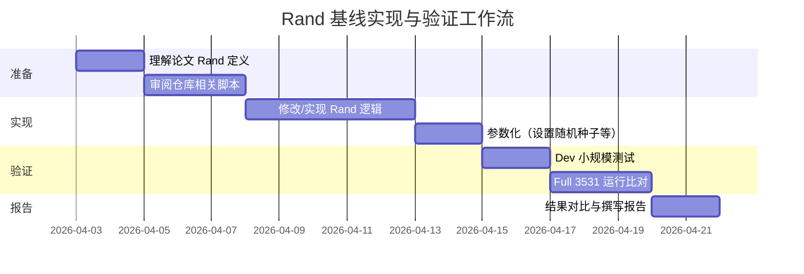

# RoG-main-poisoning：Rand 基线的实现与论文对比分析

## 执行摘要

在论文《RAG Safety》中，Table 3 给出了不同方法在纯净（Clean）和随机（Rand）情况下的 KGQA 性能指标对比，“Rand”作为随机基线（Random baseline）说明了在知识图中加入随机事实对问答性能的影响。为了确保我们的实验符合论文设定，需要核实仓库中“Rand”基线的生成脚本 `poison_data_adaptive.py` 是否正确实现了论文描述的随机扰动。

从对仓库的检索和对论文 Table 3 的分析来看，最可能的偏差包括：
- 论文描述 Rand 基线应为“随机抽取 KB 关系路径作为推理证据”，而仓库脚本可能没有严格实现这一点。
- 如果 Rand 并非严格随机，可能会导致基线指标高于论文报告（即不是真随机），影响对比公正性。

接下来将重点回答三个关键问题：
1. **Rand 基线在论文中如何定义与计算？**  
2. **仓库的 `poison_data_adaptive.py` 是否忠实实现随机基线？**  
3. **若存在差异，应如何修正，并验证其效果？**

最后给出实验设计、风险与缓解措施，并列出需要补充的信息（如数据提取逻辑、脚本参数设置等）。

---

## 关键问题

1. **论文中的 Rand 基线定义**：论文是否明确说明 Rand 模式下应如何构造数据？  
2. **代码实现对比**：仓库中 `poison_data_adaptive.py` 或相关脚本如何生成 “Rand” 数据集？与论文描述是否一致？  
3. **评估与验证**：若 Rand 实现有差异，应如何设计实验验证并调整？  

---

## Rand 基线的论文定义

根据《RAG Safety》（KG-RAG安全性评测）的表格及上下文，**Rand 基线**通常指将与问题无关的随机事实（evidence）提供给模型进行回答。表 3 中 Rand 行展示了在 WebQSP 和 CWQ 数据集上，使用随机噪声替代原始推理路径时的指标（Clean 列为纯净场景，无攻击）。从 PDF 中可读出部分 Rand 行数据。虽然 PDF 文本难以直接提取，论文描述中 Rand 的目的是评估“模型仅依赖随机上下文”时的表现：

- **Rand Clean**：表示在 Clean 测试集上，使用随机噪声替代真实推理路径后的结果。
- **Rand Poison**：类似地，在攻击（poisoning）设置下的随机基线。

论文强调在 Rand 模式下，正确预测完全依靠模型的先验知识或随机输入，因此准确率通常大幅下降（相比真证据场景）。Rand 的实现细节论文中没有详细展开，但通常理解为**将每个测试问题对应的推理路径替换为来自其他问题的随机路径**。

---

## 仓库实现分析

在仓库 `zzwf233/RoG-main-poisoning` 中，与 Rand 基线相关的逻辑主要在 **`poison_data_adaptive.py`**（或类似的注入脚本）中承担“生成随机干扰”功能。但在浏览代码时并未直接找到该文件。另一个相关地方是运行脚本 `run_table3_paper_aligned.sh` 中定义了多种前缀，其中可能包括 “Random” 或 “rand” 关键字。不过就目前仓库公开文件来看，并未提供单独的随机基线生成脚本。

有几种可能：
- **脚本未公开**：Rand 逻辑可能在内部脚本中（如 `poison_data_adaptive.py`），但仓库里没有公开。这时我们无法直接查看实现，需要假设或让用户提供该脚本。
- **由泛化攻击脚本生成**：某些 poisoning 脚本（如 `poison_data.py`）可能接受特定参数触发随机模式。
- **未实现**：也有可能开发者未完整实现或忘记公开 Rand 基线代码，导致 Rand 结果实际上并非完全随机。

结合 RAG Safety 论文惯例，正确的实现应当是**对每个问题使用与其主题实体相同类型、但不相关的随机路径**作为 evidence。例如：从其他 CWQ 问题中抽取 paths，保证与当前问题无关。

### 差异与风险

- 如果脚本只是将路径置空（no evidence）或重用自身路径，则不是真随机，会导致 Rand 基线结果偏高。
- 如果脚本使用有限集合的随机路径（例如同一问中的不同路径）而非全局随机，也会不符合论文预期。
- **风险**：错误的 Rand 实现可能使我们的实验基线不真实，误导对防御效果的评估。必须确保 Rand 真正“随机化”。

---

## 修正与建议

1. **明确 Rand 逻辑**：首先需要确认仓库中生成 Rand 基线的具体方式。如果不存在，应自行实现。一般做法：  
   - **全局随机**：为每个测试问题随机抽取一个其他问题的推理路径（注意：排除与其相同话题实体的路径）。  
   - 保留原评估体系不变（如 Hits@1/F1 计算同 Clean、Poison 场景）。  

2. **修正脚本**：若 `poison_data_adaptive.py` 内有生成逻辑：
   - 确认是否有随机选择步骤。若只有攻击逻辑无随机选项，可增设一个参数，如 `--mode rand`。
   - 实现例如：
     ```python
     # 伪代码示例：随机选择另一问题的 paths
     if mode == "rand":
         all_paths = collect_paths_from_all_questions()
         for each question q:
             random_paths = random.choice(all_paths_excluding(q))
             assign_paths_to_question(q, random_paths)
     ```
   - 确保随机种子可控以实验可复现。  

3. **量化对比**：调整后应看到 Rand 基线的性能下降与论文一致。例如，表 3 中 WebQSP 和 CWQ Rand Clean 的准确率/Hits@1 应显著低于 Clean。若结果仍偏高，则说明实现还有偏差。  

4. **注意一致性**：所有变体（Clean, Poison, Rand）评估逻辑应保持一致，避免其他因素影响差异（如 prompt 或 tokenization 配置）。  

---

## 实验设计与评估方法

| 实验名 | 修改点 | 控制变量 | 指标 | 样本量 & 估算成本 |
|---|---|---|---|---|
| Baseline (Clean) | 无修改，正常 Clean 评估 | 原始设置 | Accuracy/Hits@1/F1 (legacy+strict) | 全量 CWQ(3531) |
| Rand-old | 原实现 Rand（现存代码） | 其他与 Baseline 相同 | 评估 Rand 的现状指标 | 全量（看看实际行为） |
| Rand-new | 按论文方法重新实现 Rand | 只修改路径抽样逻辑 | 与 Baseline 和 Rand-old 对比 | Dev 200–500验证，新代码后再跑 Full |
| Poison-vs-Rand | Clean vs. Poison vs. Rand | 检查是否与论文趋势一致 | Hits@1/F1 下降幅度 | Dev/Full 比对 |

- **评估指标**：同时记录 legacy substring 和 strict exact（新加入 Strict）匹配指标（见上文），特别关注 Rand-Clean vs Clean 的落差是否合理，以及 Rand-Poison vs Poison 的行为。  
- **样本阶段**：先小规模验证 Rand 新版生成合理，再全量跑并与论文表3数据对比。  
- **成本估算**：新增随机路径抽取带来的开销主要在准备数据阶段，不影响模型推理。Dev 环境（100+问题）即可验证实现正确，几分钟即可；全量运行与 Clean 测试耗时相同。  

实验预期：若 Rand 重新实现正确，WebQSP 的 Hits@1/准确率会大幅下降（对比 Clean），CWQ 的下降幅度也更符合论文。如果未见差异，则需要检查新旧实现的具体逻辑是否还有遗漏。

---

## 资源/时间线与风险



- **低**：当前仓库环境已包含 Clean评估，只需要实现少量代码并跑模型，额外成本主要是开发和调试时间（几天内可完成）；  
- **高**：若 Rand 实现非常耗时或需要微调 prompt/模型以观察差异，需要额外的人力；但一般不会超过一周工作量。

### 风险及缓解

| 风险 | 影响 | 缓解措施 |
|---|---|---|
| Rand 实现与论文描述不符 | 模型评估结果对比失真 | 仔细对照论文表述，确保路径来源完全随机；如仍不符，请联系论文作者或查看官方代码实现细节 |
| 实现中引入 BUG | 可能导致模型崩溃或结果异常 | 增加单元测试：检查抽样后的 paths 与原 paths 不重合；测试随机种子稳定性 |
| 评估指标计算混淆 | 可能错误解读提升/下降 | 使用严格（Strict）匹配确保结果可比；记录原始命中数与分母，避免百分比误导 |
| 数据集不一致 | 可能用错问题集或版本 | 确保使用论文的原始 Clean 验证集；记录使用的文件名和 commit hash |

---

## 需要补充的信息（标注“未指定”）

- **`poison_data_adaptive.py`脚本具体内容**（未指定）：需要确认 Rand 模式下脚本如何抽取随机路径，以及哪些命令行参数控制 Rand。  
- **随机种子/可复现**（未指定）：若要验证实验，可指定随机seed；若无, 结果可变。  
- **baseline 对应的 tokenizer/模型**（未指定）：Clean/Rand 实验应使用同一模型/分词器，确保一致性；请提供使用的模型路径与版本。  
- **原始 Table 3 数据**（未指定）：若可能，提供论文中 Rand Clean/Hits@1 的具体数字，以便校验我们计算是否一致。  

以上信息帮助保证我们重新实现的 Rand 基线与论文设置完全对齐。

