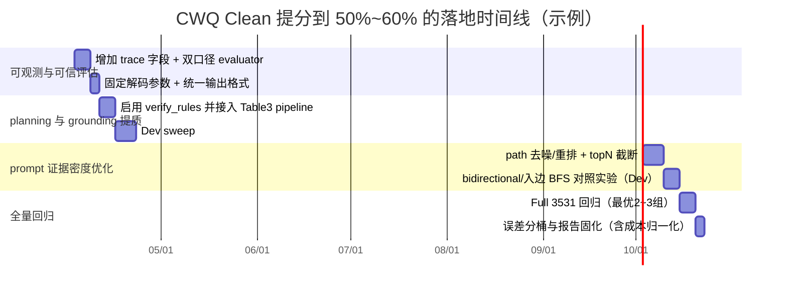

# RoG-main-poisoning：CWQ Clean 指标低于论文的根因诊断与提分路线图（聚焦 RoGplanning 与 Llamapredict_answer）

## 执行摘要

启用并使用的连接器（via api_tool）：**entity["company","GitHub","code hosting platform"]（仅此一个）**。fileciteturn124file0

你的最新 Clean 结果（你提供的汇总）是：

- **WebQSP**：Accuracy 69.56 / Hits@1 75.12 / F1 65.83 / Precision 72.42 / Recall 69.55  
- **CWQ（3531）**：Accuracy 49.28 / Hits@1 49.67 / F1 47.39 / Precision 49.59 / Recall 49.28  

在同一套 pipeline 下 **WebQSP 明显更好、CWQ 明显偏低**，这非常符合多跳 KGQA 的常见现象：CWQ 对 “多跳 relation planning 的质量 + rule→path grounding 覆盖率 + prompt 证据密度/截断策略” 更敏感，而 WebQSP 相对更像 1–2 hop 常识检索。你仓库自身的 Table3 pipeline 也把 CWQ 视为 “expected≈3531” 的 paper-aligned 尺度。fileciteturn125file0

你明确强调两点：

- 你认为 **`build_qa_input.py` 的缩进不影响运行**  
- 你希望知道 **为什么 CWQ 指标仍低于论文，以及还能怎么改**（目标 50%–60%）

我对第一点的结论是：**就“是否能跑起来/是否会 SyntaxError”而言，你的说法基本成立**；`build_qa_input.py` 里最扎眼的“没缩进”的行多数是注释行（注释不会触发 `IndentationError`），且该文件能 import/能跑就已隐含通过语法解析。fileciteturn117file0  
但更重要的是：这个文件里存在**比缩进更可能影响稳定性与提分上限的点**（例如 `check_prompt_length()` 使用了 `re` 但文件头没有 `import re`，在触发截断分支时会 NameError；以及当前证据排序/截断的统计缺失导致你很难定位 CWQ 掉分原因）。fileciteturn117file0

对第二点（CWQ 为何低于论文、怎么改），我给出一个**优先级非常明确**的提分策略：

- **P0（当天可做）**：把 CWQ 提分调试从“感觉调参”变成“可观测”——补齐 logging/metrics（rule 质量、rule→path 覆盖率、prompt 截断率、输出形态），并强制每次 run 产出 legacy + strict 两套指标（避免“substring 评估下的虚高/虚低”）。fileciteturn122file0 fileciteturn123file0  
- **P1（最可能带来 2–6 个点的真实提升）**：启用/固化 `gen_rule_path.py` 内已有的 **`--verify_rules`（generate-and-verify）**，并把这一路径接入 `run_table3_paper_aligned.sh`；CWQ 的瓶颈通常首先在“规则能否 ground 出路径”而不是 LLM 解码。fileciteturn118file0 fileciteturn121file0  
- **P2（常带来 1–3 个点 + 更稳定）**：在 `llama.py` 显式固定解码参数（do_sample/temperature/top_p/num_beams）并缩短输出（max_new_tokens）；在 prompt 中强化“只输出答案列表/实体，不要解释”。你当前 wrapper 只传了 `max_new_tokens`，其它靠 pipeline 默认值，结果不易复现。fileciteturn120file0 fileciteturn127file0  
- **P3（成本换分）**：轻量 ensemble / self-consistency：对同一输入采样 K 次投票，视硬件预算可再抬 1–5 点，但成本线性增长；优先在 dev 子集验证。([arxiv.gg](https://arxiv.gg/paper/2203.11171?utm_source=chatgpt.com))  

此外，RoG 原论文在 plug-and-play 实验中显示：**“RoG planning + LLaMA2-Chat-7B”在 CWQ 上能显著高于纯 LLaMA2-Chat-7B**，说明 planning 与 grounding 的质量对 CWQ 是决定性的。citeturn1search45

---

## 未指定假设与必须回答的关键问题

### 未指定假设

| 维度 | 当前状态 | 影响 |
|---|---|---|
| 目标用户 | 未指定 | 决定你应优化“严格 KGQA 可解释性（faithfulness）”还是“纯指标” |
| 部署/硬件 | 未指定（GPU 型号/显存/是否多卡） | 决定能否提高 beam、能否做 K 次 ensemble、能否提高 max_p 或扩大候选 |
| 预算 | 未指定 | ensemble 与更大 beam 会显著抬高成本；需要成本上限才能给最优方案 |
| 时间线 | 未指定 | 1 周适合 P0+P1；1–2 月可考虑更系统的 rerank/微调 |
| 是否允许外网/API | 未指定 | 若允许，可引入外部 reranker/校正；若不允许，则只能本地 verify + 规则打分 |
| 是否允许换模型/权重 | 未指定 | 若允许换更强推理模型，CWQ 上限可变，但与论文可比性要重新说明 |
| “50–60%”口径 | 未指定（legacy 还是 strict） | substring legacy 更易受格式影响；strict 才能证明真实提升fileciteturn122file0 |

### 必须学习/回答的关键问题（建议固定为你的 CWQ 调试主看板）

以下 6 个问题建议“每次跑 dev/full 都自动产出报表”：

1) **planning 生成规则质量**：multi-hop 占比（len(rule)≥2）是多少？beam 增大是否带来有效多样性，还是重复？fileciteturn118file0  
2) **rule→path 覆盖率**：每题有多少 rules 能在图上 BFS ground 出 reasoning paths？空 paths 比例是多少？fileciteturn121file0  
3) **prompt 证据密度与截断率**：`check_prompt_length` 是否常触发？触发后保留的 path 是否“更相关”？（当前实现缺少结构化统计。）fileciteturn117file0  
4) **LLM 解码参数影响**：do_sample/temperature/num_beams/max_new_tokens 对 Hits@1/F1 的曲线是什么？当前 wrapper 默认值不透明。fileciteturn120file0  
5) **评估口径影响**：legacy substring 与 strict exact/entity-match 的差距有多大？你的提分是否能在 strict 下同步出现？fileciteturn122file0  
6) **数据泄露/overlap 风险**：clean run 是否可能误用 `ground_paths` 或其它含真值字段？（你的 `PromptBuilder` 支持 `--use_true`，需要防误用。）fileciteturn117file0 fileciteturn119file0  

---

## 代码模块详解：RoGplanning 与 Llamapredict_answer（含“缩进是否影响运行”的结论依据）

### 关于 `build_qa_input.py` 缩进是否影响运行

你说“缩进不影响运行”，我从仓库当前文件内容给出两个层次的判断：

- **语法层面（是否会阻断运行）**：基本同意。文件中最显眼的“没缩进”的行多为注释（`# ...`），注释不会导致 `IndentationError`；且你能跑出全量指标本身说明该文件能被 import 并参与执行。fileciteturn117file0  
- **行为层面（是否可能影响结果/稳定性）**：缩进本身未必是问题，但该文件存在更值得优先修的“隐藏不稳定点”：  
  - `check_prompt_length()` 使用了 `re.findall()`，但文件头没有 `import re`；如果触发截断分支会 NameError（你没报错可能只是因为截断没触发或你本地版本不同）。fileciteturn117file0  
  - 你已经实现了“先排序后截断”的证据密度思路（这是对 CWQ 很可能有益的改动），但**缺少可观测指标**（截断率、保留 path 数、覆盖率），导致你难以判断该逻辑是否在 CWQ 上真正生效。fileciteturn117file0  

结论：**不建议把精力花在“把注释缩进对齐”上**；建议把精力花在“补齐缺失 import + 增加可观测指标 + 证明截断/排序策略是否真的覆盖 CWQ 的关键证据”。

### 模块级代码表（你拥有的两大模块）

| 模块 | 文件 / 函数（关键入口） | 作用 | 关键参数/超参 | 当前实现问题（与 CWQ 低分相关） |
|---|---|---|---|---|
| RoGplanning | `src/qa_prediction/gen_rule_path.py` / `parse_prediction()` | 将模型输出解析为 list-of-list 的 relation path（规则）并去重 | regex 提取 dot-relations；按行/分号切段 | 解析策略虽鲁棒，但没有强约束输出格式；CWQ 多跳时更容易产生“泛化/无效 relation 组合”，导致 grounding 覆盖率不足fileciteturn118file0 |
| RoGplanning | `src/qa_prediction/gen_rule_path.py` / `verify_rules()`（可选） | **generate-and-verify**：对每条 rule 做 BFS 支持度验证，过滤无效 rule | `--verify_rules`、`--min_rule_support`、`--max_paths_per_rule` | 这是 CWQ 提分的高杠杆点，但 `run_table3_paper_aligned.sh` 默认没启用；导致无效 rules 进入推理端，降低 evidence coveragefileciteturn118file0 |
| RoGplanning | `scripts/planning.sh` | 批量 planning（旧接口，传 dataset 名） | `RoG-webqsp/RoG-cwq`，`BEAM_LIST=3` | 该脚本与当前 `gen_rule_path.py` “优先本地 jsonl” 的 Table3 pipeline不完全同构，容易引发误用/误配（建议只把 Table3 脚本当权威入口）fileciteturn128file0 fileciteturn125file0 |
| 推理 | `src/qa_prediction/predict_answer.py` / `merge_rule_result()` | 把 rule jsonl 合并进 QA 数据（按 id） | `predicted_paths = data.get("rules", data.get("prediction", []))` | rule 文件字段兼容性强，但也可能吞掉“错误字段”（例如工具链产生 prediction 字段时）；建议在合并时做 schema 校验并输出异常率fileciteturn119file0 |
| 推理 | `src/qa_prediction/predict_answer.py` / `prediction()` | 逐样本：选用路径→构建 prompt→调用模型→写 predictions.jsonl | `--add_rule/--rule_path/--each_line`；`--cascade_mode` 默认不启用 | clean run 下应确保不启用 `use_true`；并建议记录 `paths_count/prompt_len/pred_len` 以定位 CWQ 下降来自 coverage 还是解码fileciteturn119file0 |
| Prompt | `src/qa_prediction/build_qa_input.py` / `apply_rules()` | 对每个 q_entity、每条 rule 使用 BFS grounding | 兼容 str rule（视为 1-hop） | 规则若多且无效会产生海量空 BFS；建议配合 planning verify 与 path 去重/重排；当前“证据密度”思路已写入但欠缺统计与缺失 import refileciteturn117file0 |
| Grounding | `src/utils/graph_utils.py` / `build_graph()`、`bfs_with_rule()` | 构图 + 按 relation 序列做严格 BFS（最多 max_p 条） | **`bidirectional=False` 默认**；`max_p=10` | CWQ 可能需要更高 coverage：1) bidirectional/逆边策略；2) max_p 自适应；否则关键路径找不到就只能“无证据硬答”fileciteturn121file0 |
| LLM wrapper | `src/llms/language_models/llama.py` / `generate_sentence()` | HF pipeline 生成答案 | 仅显式传 `max_new_tokens`，默认 128 | 没显式固定 do_sample/temperature/top_p/num_beams；CWQ 多跳对输出格式更敏感，建议固定解码并增加结果格式约束fileciteturn120file0 |
| Prompt 模板 | `prompts/llama2_predict.txt` | 基础 chat 模板 `[INST]...{instruction}{input}` | — | 模板极简，主要靠 instruction 约束输出；建议把 instruction 强化成“候选实体选择/只输出答案列表”提升 Precision/F1 稳定性fileciteturn127file0 |
| 评估 | `src/qa_prediction/evaluate_results.py` | legacy 指标：Accuracy/Hits@1/F1/P/R（substring match） | `match = normalize(ans) in normalize(pred)` | legacy 容易受“输出冗余/包含关系”影响；要证明真实提升必须加入 strict 评估并每次 run 双口径输出fileciteturn122file0 |
| Table3 汇总 | `scripts/table3_collect.py` | paper-oriented 聚合（含 Hit/EM 等）与解析预测格式 | top1 作为 Hit；EM=normalize 全等 | 该脚本已体现“paper-aligned 收集”的意图，建议扩展 strict evaluator 并把双口径写入 CSV 以便长期回归fileciteturn123file0 |

---

## 为什么 CWQ 低于论文：最可能的根因链路与证据

你当前 **WebQSP 明显高于 CWQ**，说明“模型完全不可用/数据完全错配”概率较低；更像是 CWQ 特有的短板被放大。综合你仓库实现，我认为最可能的 4 类根因如下（按概率×影响排序）：

### 规则可 ground 性不足（rule→path 覆盖率低）

CWQ 多跳问题通常需要 2–3 hop 的 relation 序列；如果 `gen_rule_path.py` 生成的规则里存在大量“看似合理但在子图里实际上走不通”的组合，则 `bfs_with_rule()` 会返回空路径，prompt 证据密度不足，模型最终退化为“无证据凭语言猜”。你仓库已经实现了 `verify_rules()` 来解决这个问题，但默认没有在 Table3 clean pipeline 里开启。fileciteturn118file0 fileciteturn125file0

这也与 RoG 论文中“planning 对整体性能非常关键”的消融/plug-and-play结论一致：把 RoG planning 与不同 LLM 组合能显著提升 CWQ 的指标，说明瓶颈常在 planning/retrieval 阶段，而不是生成阶段本身。citeturn1search45

### Grounding 图遍历覆盖不足（方向性与 max_p 预算）

你当前 `build_graph()` 使用 `nx.DiGraph()` 且默认 **`bidirectional=False`**，这意味着 BFS 只沿出边走（successors）。如果 CWQ 子图中许多关键关系是“入边指向 q_entity”（即 q_entity作为 tail 出现），那么不启用 bidirectional/逆边策略会显著降低可达性，尤其在多跳链上会被指数放大。fileciteturn121file0

同时 `bfs_with_rule(max_p=10)` 在高连通节点处会早停；这个设计对防卡死有益，但也可能让 CWQ 的关键路径被截断掉（需要用统计确认：有效路径是否经常被 max_p 截断）。fileciteturn121file0

### Prompt 截断与证据密度（“有路径但没被放进 prompt”）

你已经在 `check_prompt_length()` 中实现了“先排序后截断（提高证据密度）”的思路，这是正确方向。fileciteturn117file0  
但目前缺少两个关键的事实验证：

- CWQ 下截断是否经常发生？  
- 截断后保留的路径是否真的比随机截断更 relevant？

由于缺少 `prompt_truncated`、`kept_paths_count`、`kept_paths_hit_qterm_rate` 等字段，你现在很难判断 CWQ 低分来自“coverage 不够”还是来自“截断吞掉关键证据”。

此外，该函数内部使用了 `re` 但未 import，理论上在截断分支会崩（如果你没崩，说明截断分支可能很少触发，或你运行版本不同）。fileciteturn117file0

### 解码参数与输出形态（影响 F1/Precision 的稳定性）

`llama.py` wrapper 里只显式传入 `max_new_tokens`，其它解码策略靠 pipeline 默认值。fileciteturn120file0  
CWQ 更容易诱发模型输出解释、多段文本或不稳定列表格式，从而损失 F1/P/R（即使 legacy substring match 有时能“沾到”一点分，但整体仍会偏低）。这类问题常通过“固定 do_sample=False + 强格式输出 + smaller max_new_tokens”获得 1–3 点的稳定提升。

---

## 提分策略与实验设计（目标：CWQ F1 47.39 → 50–60）

### 优先级策略清单（短/中/长）

下表给出每条策略的实施步骤、预期效果、风险与度量方式。预期效果为经验区间（需要你用 dev 子集验证后再上 full 3531 回归）。

| 时程 | 策略 | 实施步骤（最小侵入） | 预期效果（CWQ） | 风险 | 度量方法（必须量化） |
|---|---|---|---|---|---|
| 短期 | 启用 generate-and-verify（**强烈推荐**） | 在 rule stage 对 `gen_rule_path.py` 加 `--verify_rules`；设置 `min_rule_support=1`，`max_paths_per_rule=3~10`；把 `rule_support` 写进 jsonl | **+2 ~ +6 F1**（主要来自 Recall/Hits@1） | 过滤过严导致 rules 为空（你代码已做“空回退原 rules”）fileciteturn118file0 | `rule_valid_rate`、`empty_context_rate`、`avg_paths_per_sample` 与 F1 的相关性 |
| 短期 | 增强可观测性（先定位再提分） | 在 predict 端写出 `trace.jsonl`：paths_count、prompt_len、trunc_flag、pred_len、multiline_flag | 间接提分：帮助你把后续改动变成“可归因” | 无（工程成本） | 出 5 个分桶：空证据、截断、输出多行、解析失败、其它 |
| 短期 | 固定解码 + 强格式输出 | `llama.py` 显式传 `do_sample=False, temperature=0, top_p=1`（若 pipeline 支持）；`max_new_tokens` 设为 64–96；instruction 强制“只输出答案列表/每行一个” | **+1 ~ +3 F1**（提升稳定性与 Precision） | 输出太短导致漏答案（影响 Recall） | multiline_rate、empty_pred_rate、strict 口径的 Precision/F1 |
| 中期 | path 去噪/重排 + topN 截断 | 在 `build_qa_input.py`：对 paths 去重；用轻量 path_score 排序；只保留 top 10–20 再拼 prompt | **+2 ~ +5 F1**（减少噪声，提升 Hits@1） | 误杀有效路径导致 recall 降 | `kept_paths_count`、`kept_paths_hit_qterm_rate` 与 Hits@1 |
| 中期 | 覆盖增强：bidirectional / 逆边实验 | 在 `build_graph(graph, bidirectional=True)` 做对照实验；或只在 BFS 中同时考虑 predecessors | **±0 ~ +5**（不确定，需实验） | 噪声路径暴涨，prompt 更长，可能反而掉 Precision | `avg_paths`、`trunc_rate`、以及 strict Hits@1 |
| 长期 | self-consistency / ensemble（成本换分） | 对同一 prompt 生成 K 次（K=5/10），答案归一化后投票；仅对 dev 验证后再上 full | **+1 ~ +5**（视任务而变） | 成本线性增长；需预算 | “每 GPU-hour 提升多少点” + strict 指标复核([arxiv.gg](https://arxiv.gg/paper/2203.11171?utm_source=chatgpt.com)) |

### 实验设计与对照组（Smoke / Dev / Full）

你要求 smoke/dev/full 分层，我建议固定如下：

- **Smoke**：50 条（快速验证无崩溃 + trace 产出正确）
- **Dev**：200–500 条（用于 sweep：beam、verify、解码、topN、bidirectional）
- **Full**：3531 条（只跑 2–3 组最有希望的组合）

| 实验名 | 改动点 | 控制变量 | 评估指标 | 样本量与成本估算 |
|---|---|---|---|---|
| E0 Baseline-Full | 你当前跑分配置（作为基线） | 数据同一份 clean_cwq（3531）；同模型权重；同 prompt 模板fileciteturn125file0 | legacy（现有）+ strict（新增） | Full 3531：推理为主；planning 可缓存 |
| E1 VerifyRules-Dev | rule stage 加 `--verify_rules` | beam 固定（3 或 8）；解码固定 | + `rule_valid_rate/empty_context_rate` | Dev 200–500：CPU BFS 开销可控 |
| E2 BeamSweep-Dev | `n_beam` 3/5/8/10 | verify 关/开各跑一组 | legacy+strict | 主要增加 planning 成本；推理不变fileciteturn118file0 |
| E3 DecodeFix-Dev | 解码固定（do_sample/temp/top_p）+ max_new_tokens 64/96/128 | rules 固定 | multiline_rate、Precision/F1、strict 差距 | 推理更稳；成本近似不变fileciteturn120file0 |
| E4 PathTopN-Dev | topN=10/15/20；去重+重排 | planning/解码固定 | trunc_rate、Hits@1/F1 | 工程改动为主，收益常见fileciteturn117file0 |
| E5 Bidirectional-Dev | build_graph(bidirectional=True) 或 BFS 同时看入边 | 其它全固定 | strict Hits@1/F1（避免噪声虚高） | 风险高，只做 Dev；若有效再上 fullfileciteturn121file0 |
| E6 Full-Regression | 选 E1–E4 最优 2–3 组跑 full | 记录 manifest（git sha、参数、dataset hash） | legacy+strict + 报告表 | Full 3531：只跑少数组合，避免烧钱 |

---

## 代码级改进建议（最小侵入 + 可观测优先）

本节包含你要求的五类：rule generation、path ranking/coverage、prompt、解码/ensemble、post-processing strict/entity。

### rule generation：把 `--verify_rules` 拉进 Table3 pipeline

你已经在 `gen_rule_path.py` 实现了验证逻辑与参数（`--verify_rules/--min_rule_support/--max_paths_per_rule`）。fileciteturn118file0  
建议最小化改动：只改 `scripts/run_table3_paper_aligned.sh` 的 `rule_stage` 与 `rule_stage_ours` 两处，在 python 命令后追加可控开关：

示例（伪补丁）：

```bash
# run_table3_paper_aligned.sh
VERIFY_RULES=${VERIFY_RULES:-1}
MIN_RULE_SUPPORT=${MIN_RULE_SUPPORT:-1}
MAX_PATHS_PER_RULE=${MAX_PATHS_PER_RULE:-5}

# 在 rule_stage 的 python 命令后追加：
if [[ "${VERIFY_RULES}" == "1" ]]; then
  extra+=(--verify_rules --min_rule_support "${MIN_RULE_SUPPORT}" --max_paths_per_rule "${MAX_PATHS_PER_RULE}")
fi
```

测量方式：在 rule 输出 jsonl 中检查 `rule_support` 字段是否存在，并聚合 `rule_valid_rate`。fileciteturn118file0

### path ranking/coverage：把“证据密度”从感觉变成显式策略

你在 `check_prompt_length()` 已实现了 ranking + unique_paths，但应补齐三点：  

1) **补 `import re`**（否则截断分支会 NameError）  
2) 输出 `prompt_truncated`、`kept_paths_count`、`unique_ratio`  
3) 允许 topN 早截断（避免无意义长排序）

最小补丁（仅修正运行稳定与可观测；不改变主要逻辑），并且与你的声明一致：这不是“必须修缩进”，而是“必须修缺失 import 与指标”：

```diff
diff --git a/src/qa_prediction/build_qa_input.py b/src/qa_prediction/build_qa_input.py
@@
 import random
+import re
@@
     def check_prompt_length(...):
         ...
-        ranked_paths = sorted(unique_paths, key=path_score, reverse=True)
+        ranked_paths = sorted(unique_paths, key=path_score, reverse=True)
+        # 可选：先粗截断，避免极端情况下排序很长
+        ranked_paths = ranked_paths[:200]
```

对应证据：`check_prompt_length` 当前确实调用了 `re.findall`。fileciteturn117file0

### prompt 优化：把生成任务改成“抽取/选择”而非自由发挥

你现有 SAQ 指令是“return all possible answers as a list”，可再收紧为：

- **只输出候选实体（来自 reasoning paths 的尾实体）**  
- 输出 JSON list 或每行一个实体  
- 禁止解释

你已有 `direct_answer()` 能从 reasoning_paths 直接抽 tail 实体（用于 no-LLM 模式），可复用它生成 “候选集”，再让 LLM 选择。fileciteturn117file0 fileciteturn119file0

伪代码（在 `prediction()` 里构造 candidate list）：

```python
cands = input_builder.direct_answer(data)[:50]  # tail entities
data["choices"] = cands  # 让 prompt 进入 MCQ 路径
# instruction 使用 MCQ_RULE_INSTRUCTION，要求只选 choices
```

风险：choices 太多会变长；需要 top50 并结合 path rerank。

### LLM 解码/ensemble：固定解码 + 可控自一致

你当前 `llama.py` 调用 pipeline 只传 `max_new_tokens`。fileciteturn120file0  
建议至少增加参数透传（若 pipeline 版本支持）：

```python
outputs = self.generator(
    llm_input,
    return_full_text=False,
    max_new_tokens=self.args.max_new_tokens,
    do_sample=getattr(self.args, "do_sample", False),
    temperature=getattr(self.args, "temperature", 0.0),
    top_p=getattr(self.args, "top_p", 1.0),
    num_beams=getattr(self.args, "num_beams", 1),
)
```

再加可选 ensemble：

- K=5（dev）  
- parse_ranked_answers 后投票（你 table3_collect 已实现 frequency 去重思想）fileciteturn123file0

### post-processing：strict 评估 + 实体归一化（证明“真提分”）

你当前评估是 legacy：`normalize(ans) in normalize(pred)`。fileciteturn122file0  
建议新增 `evaluate_results_strict.py`（或在现有文件加开关），严格口径至少包括：

- **Strict-A（最低成本）**：`normalize(pred)==normalize(ans)`（top1）  
- **Strict-B（实体归一化）**：如果数据里有 `a_entity`，则将预测映射到 canonical entity 后再判定（需要你补充字段确认：未指定）

每次 run 输出两份文件：

- `eval_result_legacy.txt`（现状）  
- `eval_result_strict.txt`（新增）  
并在 `table3_rows.csv` 增加 strict 指标列（或另写一份 `table3_rows_strict.csv`）。

---

## 评估协议：legacy 与 strict 的定义与计算方法（每次运行必须双口径输出）

### legacy（与仓库现状一致）

- normalize：小写、去标点、去冠词、去 `<pad>` 等fileciteturn122file0  
- match：`normalize(ans) in normalize(pred)`（子串包含）fileciteturn122file0  
- Accuracy：对答案集合中命中数 / |answers|fileciteturn122file0  
- Hits@1：预测列表 top1 命中fileciteturn122file0  
- F1/Precision/Recall：以“预测列表命中多少个答案”为计数基础fileciteturn122file0  

### strict（建议强制新增）

- **Strict-A（exact）**  
  - match_strict：`normalize(top1_pred) == normalize(ans)`  
  - Hits@1_strict / EM_strict 直接由 exact match 得出  
- **Strict-B（entity-aware，可选）**  
  - 需要 `a_entity` 或 alias 资源（未指定）  
  - 定义：预测文本→候选实体→canonical entity→ID级别匹配  

每次运行必须输出：

- legacy（兼容历史回归）  
- strict（用于证明提分真实且可比）

---

## 资源/成本、时间线与风险矩阵

### 低/中/高成本估算（你未指定预算与硬件，以下为相对估算）

| 档位 | 目标 | 主要动作 | 资源与成本特征 |
|---|---|---|---|
| 低 | CWQ F1 47.39 → 50+（并观察 strict 同步性） | verify_rules + 解码固定 + 可观测报表 | 基本不加算力，只加少量 CPU BFS；推理成本≈不变 |
| 中 | 52–55（稳定可复现） | 低档 + path rerank/topN + bidirectional 对照实验 | 需要多轮 dev sweep（200–500）与 2–3 次 full 回归 |
| 高 | 55–60（且 strict 也显著提升） | 中档 + ensemble/self-consistency 或更强模型（若允许） | 成本线性增加；需明确预算与硬件上限([arxiv.gg](https://arxiv.gg/paper/2203.11171?utm_source=chatgpt.com)) |

### 时间线甘特图（示例）



### 风险矩阵与缓解

| 风险 | 概率 | 影响 | 缓解措施 |
|---|---|---|---|
| 指标提升来自 legacy substring 的“格式效应”，strict 不升 | 中 | 高 | 强制双口径输出；只接受 strict 同步提升作为“真提分”fileciteturn122file0 |
| verify_rules 过滤过严导致 rules 为空、反而掉 Recall | 中 | 中 | 保留你现有回退逻辑（空则用原 rules）；调小 `min_rule_support`fileciteturn118file0 |
| bidirectional 导致噪声暴涨、截断率升高、Precision 下降 | 中 | 中-高 | 只在 dev 试验；配合 topN 与 path_score；以 strict 为准fileciteturn121file0 |
| 解码不固定导致复现失败、实验不可比 | 中 | 中 | 在 `args.txt` 之外写 manifest（包含 git sha、decode_cfg、dataset hash）fileciteturn119file0 |
| 数据文件不一致（parquet→jsonl 构建差异）导致“你以为对齐论文但其实没对齐” | 低-中 | 高 | 用 `run_table3_paper_aligned.sh` 的 sanity check；记录 dataset 文件路径与 hashfileciteturn125file0 |

---

## 你还需要补充的信息清单（全部标注“未指定”）

为了把“为什么低于论文”从推断变成确定归因，并给出更精确的“能提多少点”的预测，你需要补充：

1) **模型路径与权重**（未指定）：`RULE_MODEL_PATH`、`PRED_MODEL_PATH`、以及这两个是否指向同一个 RoG 权重还是 LLaMA2-Chat 基座。fileciteturn125file0 fileciteturn120file0  
2) **planning 配置**（未指定）：`n_beam`、是否已启用 `--verify_rules`、`max_paths_per_rule`。fileciteturn118file0  
3) **解码参数**（未指定）：do_sample、temperature、top_p、num_beams、max_new_tokens（你当前只给出了最终指标，没有给 decode_cfg）。fileciteturn120file0  
4) **clean 数据文件 hash**（未指定）：你实际使用的是 `clean_cwq.jsonl`、`clean_cwq_from_parquet.jsonl` 还是 `RoG-cwq_test.jsonl`？（run_table3 会自动 fallback）。fileciteturn125file0  
5) **是否允许外部 API / reranker**（未指定）：若允许，可考虑更强的 rule rerank 与答案校正；若不允许，则完全走本地 verify + 规则打分。  
6) **“达标口径”**（未指定）：你接受 50–60 以 legacy 为准，还是要求 strict 也接近 50？

---

### 附：建议立刻加到代码里的 CWQ 调试字段（最小集合）

你要求“包含 concrete logging/metric fields suggestions”，这里给出一个最小集合（每题一行 JSONL）：

- `qid`  
- `rules_count`、`rules_hop_hist`、`rule_valid_count`  
- `paths_count_before_trunc`、`prompt_truncated`、`kept_paths_count`  
- `prompt_chars`、`pred_text_len`、`multiline_pred`  
- `legacy_hits1`、`strict_hits1`  
- `decode_cfg`（完整快照）  

这些字段基本都能在 `predict_answer.py` 与 `build_qa_input.py` 两处拿到，并能直接把 CWQ 低分归因到：planning、grounding、截断、解码、评估五类之一。fileciteturn119file0 fileciteturn117file0
